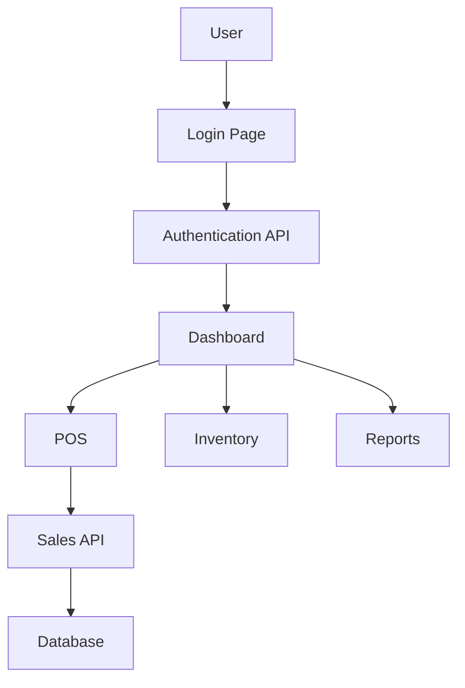
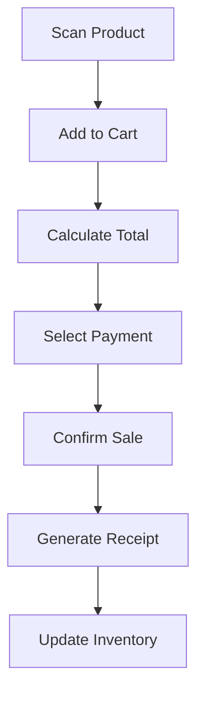
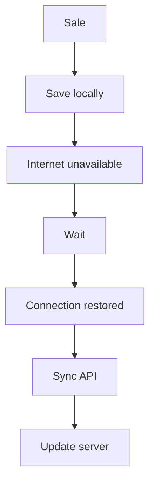
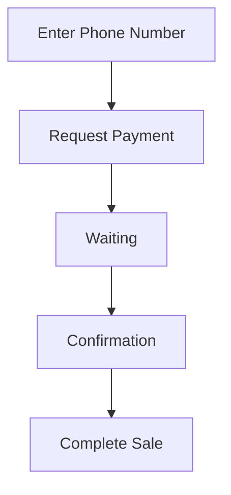

# Frontend Documentation - Inventory & Sales Management Software

## 1. Frontend Overview

The frontend is a responsive web application built for local businesses to manage:

- Inventory
- Sales (POS)
- Customers
- Suppliers
- Payments
- Reports
- Staff access
- Offline transactions

It communicates with the Java Spring Boot backend through REST APIs and uses WebSockets for real-time updates.

## 2. Frontend Technology Stack

### Core Technologies

| Technology | Purpose |
| --- | --- |
| React JS | User interface development |
| React Router | Page navigation |
| Axios | API communication |
| Context API / Redux Toolkit | State management |
| Tailwind CSS / Material UI | UI design |
| Recharts | Analytics graphs |
| React Hook Form | Form handling |
| Yup | Validation |
| IndexedDB | Offline storage |
| Service Workers | PWA offline support |
| WebSocket Client | Real-time updates |

## 3. Frontend Architecture

```text
src/
|-- assets/
|-- components/
|   |-- Navbar/
|   |-- Sidebar/
|   |-- Button/
|   |-- Modal/
|   |-- Table/
|-- pages/
|   |-- Login/
|   |-- Dashboard/
|   |-- POS/
|   |-- Inventory/
|   |-- Products/
|   |-- Customers/
|   |-- Suppliers/
|   |-- Reports/
|   |-- Settings/
|-- services/
|   |-- api.js
|   |-- authService.js
|   |-- productService.js
|   |-- salesService.js
|   |-- mpesaService.js
|-- store/
|   |-- authSlice.js
|   |-- inventorySlice.js
|   |-- salesSlice.js
|-- hooks/
|-- utils/
|-- offline/
|   |-- indexedDB.js
|   |-- syncService.js
|-- App.jsx
```

## 4. Application Flow



## 5. User Interface Modules

### 5.1 Authentication Module

**Pages**

- `/login`
- `/register`
- `/forgot-password`

**Features**

- Login
- JWT token storage
- Role checking
- Session management

### 5.2 Dashboard Module

**Route**

- `/dashboard`

**Purpose**

- Business overview

**Displays**

- Today's sales
- Profit
- Stock alerts
- Pending orders
- Top products

### 5.3 POS Module

**Route**

- `/pos`

**Purpose**

- Fast checkout interface

**Features**

- Search products
- Barcode scanning
- Cart management
- Discounts
- Tax calculation
- Payment selection
- Receipt printing

**Components**

- `POS.jsx`
  - `ProductSearch`
  - `Cart`
  - `PaymentModal`
  - `Receipt`

**POS Flow**



### 5.4 Inventory Module

**Route**

- `/inventory`

**Features**

- View stock
- Add product
- Edit product
- Delete product
- Stock adjustment
- Expiry monitoring

**Table Example**

| Product | Quantity | Price | Status |
| --- | ---: | ---: | --- |
| Milk | 50 | KES 70 | Available |

### 5.5 Product Management

**Route**

- `/products`

**Fields**

- Product Name
- Category
- Barcode
- Buying Price
- Selling Price
- Quantity
- Expiry Date
- Supplier

### 5.6 Barcode Module

**Libraries**

- `react-barcode`
- `react-qr-reader`

**Functions**

- Generate barcode for products
- Scan barcode via camera
- Look up product details

### 5.7 Customer CRM Module

**Route**

- `/customers`

**Features**

- Add customers
- View purchase history
- Track loyalty points
- Track customer balance

**Example UI**

- Customer: John Doe
- Purchases: KES 35,000
- Points: 300

### 5.8 Supplier Module

**Route**

- `/suppliers`

**Features**

- Supplier profiles
- Purchase orders
- Delivery tracking

### 5.9 Reports Module

**Route**

- `/reports`

**Reports**

- Daily: Sales, Profit, Expenses
- Weekly: Best sellers, Stock movement
- Monthly: Revenue, Loss, Growth

**Charts**

- Line Chart
- Bar Chart
- Pie Chart

## 6. API Integration

Use `services/api.js` as the main API client for REST requests.

## 7. Authentication State

Use Redux for authentication state management.

- `store/authSlice.js`

## 8. Inventory State Management

Use Redux or Context API for inventory state, depending on module complexity.

## 9. Offline Mode Implementation

**Technology**

- IndexedDB
- Service Worker

**Offline Flow**



**IndexedDB Stores**

- `transactions`
- `products`
- `customers`

## 10. Real-Time Updates

Use WebSockets to push instant updates to the UI.

**Example**

- Stock updated
- Backend sends event
- React receives event
- Dashboard updates instantly

## 11. M-Pesa Frontend Integration

**Payment Component**

- `MpesaPayment.jsx`

**Flow**



## 12. Receipt Component

**Features**

- Print
- Download PDF
- WhatsApp sharing
- Email

**Example Receipt**

```text
BUSINESS NAME

Receipt No: 00123

Item       Qty   Price
Milk       2     160

TOTAL:
160 KES

Thank You
```

## 13. Security

Frontend security includes:

- JWT authentication
- Protected routes
- Role-based UI
- Input validation
- HTTPS

## 14. Responsive Design

Supported devices:

- Desktop
- Tablet
- Mobile

**Desktop Layout**

- Sidebar | Content

**Mobile Layout**

- Menu
- Content

## 15. Environment Configuration

**File**

- `.env`

**Example**

```env
VITE_API_URL=http://localhost:8080/api
VITE_WS_URL=ws://localhost:8080/ws
```
